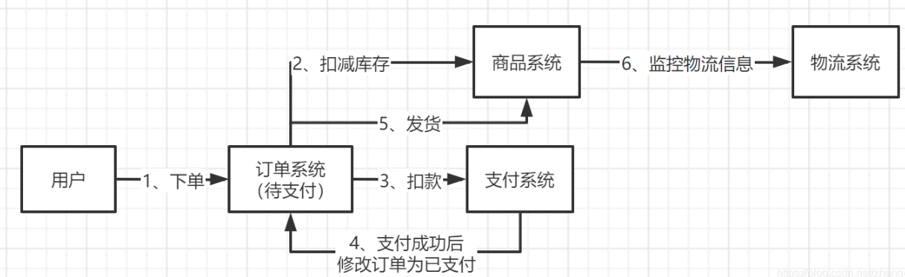
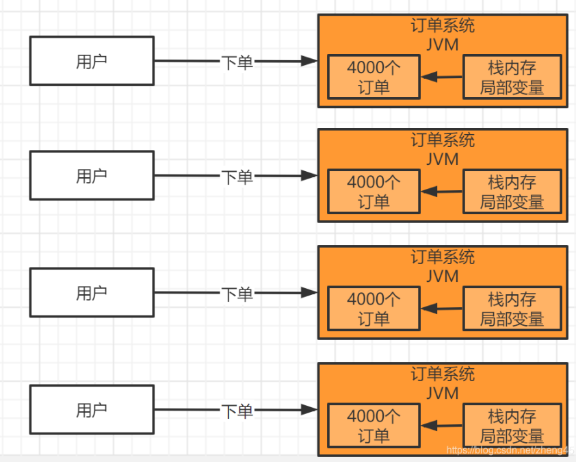

2W的TQS，线上参数如何设置

线上系统怎么进行JVM参数配置及调优？其实对于一般的系统，并发量不大，很多开发人员很少关注JVM参数配置及调优，但是为了进阶更高一层，其实可以自己模拟一个高并发的请求，然后观察JVM内存使用情况，针对高并发下垃圾回收情况进行JVM调优。
笔者开发过一个订单系统，要求TPS峰值到达2w笔/秒，所以，本章节就针对TPS 2w笔/秒高并发情况下JVM如何配置进行讲解。

## 业务流程介绍



主要流程如下：

- 用户在界面进行下单后，订单系统就会插入一条订单记录。
- 调用商品系统进行库存扣减。
- 如果库存扣减成功了，就会调用支付服务进行支付，其中支付服务设计跟第三方对接，支付订单等，这里就不详细介绍了。
- 支付成功后，会调用订单系统告诉用户已经支付成功了，订单就会修改成已支付。
- 订单修改为已支付后，会调用商品系统进行商品发货，物流监控等。

以上只是简单介绍订单系统业务逻辑，实际项目中业务逻辑可能比这个复杂得多，这里就不深入去探讨了。

## 每个订单大概需要多大内存空间

接着我们来计算一下，每个支付订单对象大概需要多大的内存空间？

其实不考虑别的，你就直接根据订单类中的实例变量的类型来计算就可以了。

比如说订单类如下所示，你只要记住一个Integer类型的变量数据是4个字节，Long类型的变量数据是8个字节，还有别的类型的变量数据占据多少字节。

```java
public class GameDealOrder {
/**
 * 订单编号
 */
private String orderId;

/**
 * 外部订单编号
 */
private String outOrderId;

/**
 * 支付订单编号
 */
private String payOrderId;

/**
 * 订单状态（0-待支付，1-已支付，2-配送中，3-已完成）
 */
private Integer orderStatus;

/**
 * 下单用户ID
 */
private Long userId;

/**
 * 商品ID
 */
private Long goodsId;

......
}
```
我们按照一个订单类有30个字段计算，一般计算下来也就几百个字节，我们按照一个订单对象500个字节。

## 每秒发起的支付请求对堆内存的占用

我们系统TPS是2w笔/秒，也就是说，一秒会创建2万个订单，那么假如我们线上订单部署的是5台机器，也就是1台机器需要处理4000个订单，1个订单是500个字节，大概占据的内存空间是 `4000 * 500字节 = 2000000`字节，大概就是2MB。这只是一个订单对象占用的内存空间，但是实际上还有其他对象，如果扩大10倍~20倍换成对完整系统的预估之后，我们看到，大致每秒会占据20MB左右的堆内存空间。



## 系统运行内存分析

根据我们的分析，每秒4000个订单请求，创建4000个对象对象，占用的堆内存空间是2MB
然后接着1秒过后，这4000个对象就没有人引用了，就成了新生代里的垃圾了。
下一秒请求过来，我们的系统持续的创建订单对象，不停在新生代里放入4000个订单，然后新生代里的对象会持续的累积和增加。
直到有一刻，发现可能新生代里都有几十万个对象了，此时占据了几个G的空间了，可能新生代空间就快满了。
然后就会触发Minor GC，就把新生代里的垃圾对象都给回收掉了，腾出内存空间，然后继续来在内存里分配新的对象。
这就是这个业务系统的运行模型。

## 堆内存设置

我们的线上系统，首先要根据并发量评估机器的配置，像如果是2wTPS的话，至少得4核8G的机器。

如果我们用2核4G的机器来部署，是比较难支撑这么大并发量的，因为4G内存，机器本身占用一些内存空间，最后JVM进程最多就是2G内存，这2G还得分配给方法区、栈内存、堆内存几块区域，那么堆内存可能最多就是个1G多的内存空间。

堆内存还分为新生代和老年代，老年代总需要放置系统的一些长期存活的对象，也得给几百MB的内存空间，那么新生代可能也就几百MB的内存了。

如果你新生代就几百MB的内存空间，是不是会导致运行十几秒之后，新生代内存空间就满了？此时是不是就得触发Minor GC？其实如果这么频繁的触发Minor GC，会影响线上系统的性能稳定性。

如果是4核8G,那么JVM进程可以占6G内存，堆内存就可以配置到5G左右（-Xms和-Xmx设置为5G），新生代配置4G（-Xmn设置为4G），这样几分钟才需要触发Minor GC，大大降低了GC的频率。

如何后续业务扩大，并发量增多，也可以考虑横向扩展机器（如由5台扩大到8台），降低单台机器的处理的请求，对JVM压力更小。

## 方法区设置

JDK8之前的版本：永久代是存一些类信息，所以一般系统设置128M或者256M基本是够用的。除非是大量用到了动态代理模式，需要创建很多类信息。这个可以根据实际场景进行调优。

JDK8及以后，设置元空间，和永久代差不多。

> 面试官可能会问永久代和元空间的区别，自行看JVM部分的面试题。

## 栈内存设置

每个线程的栈内存空间，用来存放线程执行方法期间的各种布局变量的，这个一般也不会设置太大，一般系统设置128k或者256k基本够用了。