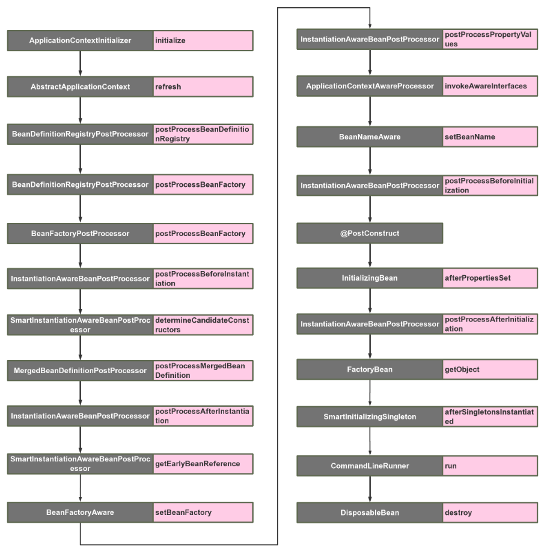
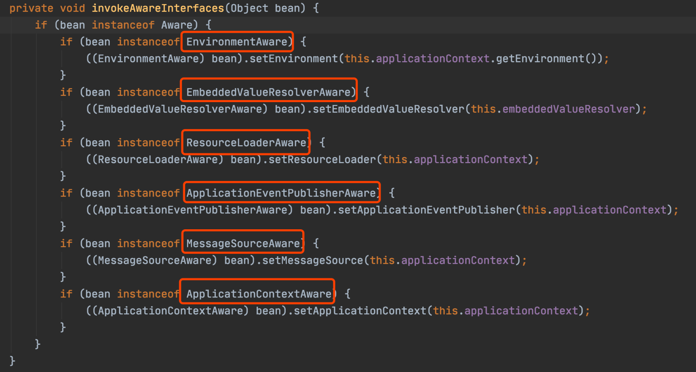

你好，我是田哥

Spring的核心思想就是容器，当容器refresh的时候，外部看上去风平浪静，其实内部则是一片惊涛骇浪，汪洋一片。Spring Boot更是封装了Spring，遵循约定大于配置，加上自动装配的机制。很多时候我们只要引用了一个依赖，几乎是零配置就能完成一个功能的装配。

我非常喜欢这种自动装配的机制，所以在自己开发中间件和公共依赖工具的时候也会用到这个特性。让使用者以最小的代价接入。想要把自动装配玩的转，就必须要了解Spring 对于bean的构造生命周期以及各个扩展接口。当然了解了bean的各个生命周期也能促进我们加深对Spring 的理解。业务代码也能合理利用这些扩展点写出更加漂亮的代码。

在网上搜索Spring 扩展点，发现很少有博文说的很全的，只有一些常用的扩展点的说明。

所以在这篇文章里，我总结了几乎Spring & Spring Boot所有的扩展接口，以及各个扩展点的使用场景。并且整理出了一个bean在Spring 内部从被加载到最后初始化完成所有可扩展点的顺序调用图。从而我们也能窥探到bean是如何一步步加载到Spring 容器中的。

## 可扩展的接口启动调用顺序图

以下是我整理的Spring 容器中Bean的生命周期内所有可扩展的点的调用顺序，下面会一个个分析



## ApplicationContextInitializer

> org.springframework.context.ApplicationContextInitializer

这是整个spring容器在刷新之前初始化`ConfigurableApplicationContext`的回调接口，简单来说，就是在容器刷新之前调用此类的`initialize`方法。这个点允许被用户自己扩展。用户可以在整个spring容器还没被初始化之前做一些事情。

可以想到的场景可能为，在最开始激活一些配置，或者利用这时候class还没被类加载器加载的时机，进行动态字节码注入等操作。

扩展方式为：

```java
public class TestApplicationContextInitializer implements ApplicationContextInitializer {
    @Override
    public void initialize(ConfigurableApplicationContext applicationContext) {
        System.out.println("[ApplicationContextInitializer]");
    }
}
```

因为这时候spring容器还没被初始化，所以想要自己的扩展的生效，有以下三种方式：

- 在启动类中用`springApplication.addInitializers(new TestApplicationContextInitializer())`语句加入
- 配置文件配置`context.initializer.classes=com.example.demo.TestApplicationContextInitializer` 
- Spring SPI扩展，在spring.factories中加入`org.springframework.context.ApplicationContextInitializer=com.example.demo.TestApplicationContextInitializer` 

## BeanDefinitionRegistryPostProcessor

> org.springframework.beans.factory.support.BeanDefinitionRegistryPostProcessor

这个接口在读取项目中的`beanDefinition`之后执行，提供一个补充的扩展点

使用场景：你可以在这里动态注册自己的`beanDefinition`，可以加载classpath之外的bean

扩展方式为:

```java
public class TestBeanDefinitionRegistryPostProcessor implements BeanDefinitionRegistryPostProcessor {
    @Override
    public void postProcessBeanDefinitionRegistry(BeanDefinitionRegistry registry) throws BeansException {
        System.out.println("[BeanDefinitionRegistryPostProcessor] postProcessBeanDefinitionRegistry");
    }

    @Override
    public void postProcessBeanFactory(ConfigurableListableBeanFactory beanFactory) throws BeansException {
        System.out.println("[BeanDefinitionRegistryPostProcessor] postProcessBeanFactory");
    }
}
```

## BeanFactoryPostProcessor

> org.springframework.beans.factory.config.BeanFactoryPostProcessor

这个接口是`beanFactory`的扩展接口，调用时机在spring在读取`beanDefinition`信息之后，实例化bean之前。

在这个时机，用户可以通过实现这个扩展接口来自行处理一些东西，比如修改已经注册的`beanDefinition`的元信息。

扩展方式为：

```java
public class TestBeanFactoryPostProcessor implements BeanFactoryPostProcessor {
    @Override
    public void postProcessBeanFactory(ConfigurableListableBeanFactory beanFactory) throws BeansException {
        System.out.println("[BeanFactoryPostProcessor]");
    }
}
```

## InstantiationAwareBeanPostProcessor

> org.springframework.beans.factory.config.InstantiationAwareBeanPostProcessor

该接口继承了`BeanPostProcess`接口，区别如下：

BeanPostProcess接口只在bean的初始化阶段进行扩展（注入spring上下文前后），而InstantiationAwareBeanPostProcessor接口在此基础上增加了3个方法，把可扩展的范围增加了实例化阶段和属性注入阶段。

该类主要的扩展点有以下5个方法，主要在bean生命周期的两大阶段：**实例化阶段**和**初始化阶段**，下面一起进行说明，按调用顺序为：

-  `postProcessBeforeInstantiation`：实例化bean之前，相当于new这个bean之前
-  `postProcessAfterInstantiation`：实例化bean之后，相当于new这个bean之后
-  `postProcessPropertyValues`：bean已经实例化完成，在属性注入时阶段触发，`@Autowired`,`@Resource`等注解原理基于此方法实现
-  `postProcessBeforeInitialization`：初始化bean之前，相当于把bean注入spring上下文之前
-  `postProcessAfterInitialization`：初始化bean之后，相当于把bean注入spring上下文之后

使用场景：这个扩展点非常有用 ，无论是写中间件和业务中，都能利用这个特性。比如对实现了某一类接口的bean在各个生命期间进行收集，或者对某个类型的bean进行统一的设值等等。

扩展方式为：

```java
public class TestInstantiationAwareBeanPostProcessor implements InstantiationAwareBeanPostProcessor {

    @Override
    public Object postProcessBeforeInitialization(Object bean, String beanName) throws BeansException {
        System.out.println("[TestInstantiationAwareBeanPostProcessor] before initialization " + beanName);
        return bean;
    }

    @Override
    public Object postProcessAfterInitialization(Object bean, String beanName) throws BeansException {
        System.out.println("[TestInstantiationAwareBeanPostProcessor] after initialization " + beanName);
        return bean;
    }

    @Override
    public Object postProcessBeforeInstantiation(Class<?> beanClass, String beanName) throws BeansException {
        System.out.println("[TestInstantiationAwareBeanPostProcessor] before instantiation " + beanName);
        return null;
    }

    @Override
    public boolean postProcessAfterInstantiation(Object bean, String beanName) throws BeansException {
        System.out.println("[TestInstantiationAwareBeanPostProcessor] after instantiation " + beanName);
        return true;
    }

    @Override
    public PropertyValues postProcessPropertyValues(PropertyValues pvs, PropertyDescriptor[] pds, Object bean, String beanName) throws BeansException {
        System.out.println("[TestInstantiationAwareBeanPostProcessor] postProcessPropertyValues " + beanName);
        return pvs;
    }
```

## SmartInstantiationAwareBeanPostProcessor

> org.springframework.beans.factory.config.SmartInstantiationAwareBeanPostProcessor

该扩展接口有3个触发点方法：

-  `predictBeanType`：该触发点发生在`postProcessBeforeInstantiation`之前(在图上并没有标明，因为一般不太需要扩展这个点)，这个方法用于预测Bean的类型，返回第一个预测成功的Class类型，如果不能预测返回null；当你调用`BeanFactory.getType(name)`时当通过bean的名字无法得到bean类型信息时就调用该回调方法来决定类型信息。
-  `determineCandidateConstructors`：该触发点发生在`postProcessBeforeInstantiation`之后，用于确定该bean的构造函数之用，返回的是该bean的所有构造函数列表。用户可以扩展这个点，来自定义选择相应的构造器来实例化这个bean。
-  `getEarlyBeanReference`：该触发点发生在`postProcessAfterInstantiation`之后，当有循环依赖的场景，当bean实例化好之后，为了防止有循环依赖，会提前暴露回调方法，用于bean实例化的后置处理。这个方法就是在提前暴露的回调方法中触发。

扩展方式为：

```java
public class TestSmartInstantiationAwareBeanPostProcessor implements SmartInstantiationAwareBeanPostProcessor {

    @Override
    public Class<?> predictBeanType(Class<?> beanClass, String beanName) throws BeansException {
        System.out.println("[TestSmartInstantiationAwareBeanPostProcessor] predictBeanType " + beanName);
        return beanClass;
    }

    @Override
    public Constructor<?>[] determineCandidateConstructors(Class<?> beanClass, String beanName) throws BeansException {
        System.out.println("[TestSmartInstantiationAwareBeanPostProcessor] determineCandidateConstructors " + beanName);
        return null;
    }

    @Override
    public Object getEarlyBeanReference(Object bean, String beanName) throws BeansException {
        System.out.println("[TestSmartInstantiationAwareBeanPostProcessor] getEarlyBeanReference " + beanName);
        return bean;
    }
}
```

## BeanFactoryAware

> org.springframework.beans.factory.BeanFactoryAware

这个类只有一个触发点，发生在bean的实例化之后，注入属性之前，也就是Setter之前。这个类的扩展点方法为`setBeanFactory`，可以拿到`BeanFactory`这个属性。

使用场景为，你可以在bean实例化之后，但还未初始化之前，拿到 `BeanFactory`，在这个时候，可以对每个bean作特殊化的定制。也或者可以把`BeanFactory`拿到进行缓存，日后使用。

扩展方式为：

```java
public class TestBeanFactoryAware implements BeanFactoryAware {
    @Override
    public void setBeanFactory(BeanFactory beanFactory) throws BeansException {
        System.out.println("[TestBeanFactoryAware] " + beanFactory.getBean(TestBeanFactoryAware.class).getClass().getSimpleName());
    }
}
```

## ApplicationContextAwareProcessor

> org.springframework.context.support.ApplicationContextAwareProcessor

该类本身并没有扩展点，但是该类内部却有6个扩展点可供实现 ，这些类触发的时机在bean实例化之后，初始化之前



可以看到，该类用于执行各种驱动接口，在bean实例化之后，属性填充之后，通过执行以上红框标出的扩展接口，来获取对应容器的变量。**所以这里应该来说是有6个扩展点**，这里就放一起来说了

-  `EnvironmentAware`：用于获取`EnviromentAware`的一个扩展类，这个变量非常有用， 可以获得系统内的所有参数。当然个人认为这个Aware没必要去扩展，因为spring内部都可以通过注入的方式来直接获得。
-  `EmbeddedValueResolverAware`：用于获取`StringValueResolver`的一个扩展类， `StringValueResolver`用于获取基于`String`类型的properties的变量，一般我们都用`@Value`的方式去获取，如果实现了这个Aware接口，把`StringValueResolver`缓存起来，通过这个类去获取`String`类型的变量，效果是一样的。
-  `ResourceLoaderAware`：用于获取`ResourceLoader`的一个扩展类，`ResourceLoader`可以用于获取classpath内所有的资源对象，可以扩展此类来拿到`ResourceLoader`对象。
-  `ApplicationEventPublisherAware`：用于获取`ApplicationEventPublisher`的一个扩展类，`ApplicationEventPublisher`可以用来发布事件，结合`ApplicationListener`来共同使用，下文在介绍`ApplicationListener`时会详细提到。这个对象也可以通过spring注入的方式来获得。
-  `MessageSourceAware`：用于获取`MessageSource`的一个扩展类，`MessageSource`主要用来做国际化。
-  `ApplicationContextAware`：用来获取`ApplicationContext`的一个扩展类，`ApplicationContext`应该是很多人非常熟悉的一个类了，就是spring上下文管理器，可以手动的获取任何在spring上下文注册的bean，我们经常扩展这个接口来缓存spring上下文，包装成静态方法。同时`ApplicationContext`也实现了`BeanFactory`，`MessageSource`，`ApplicationEventPublisher`等接口，也可以用来做相关接口的事情。

## BeanNameAware

> org.springframework.beans.factory.BeanNameAware

可以看到，这个类也是Aware扩展的一种，触发点在bean的初始化之前，也就是`postProcessBeforeInitialization`之前，这个类的触发点方法只有一个：`setBeanName`

使用场景为：用户可以扩展这个点，在初始化bean之前拿到spring容器中注册的的beanName，来自行修改这个beanName的值。

扩展方式为：

```java
public class NormalBeanA implements BeanNameAware{
    public NormalBeanA() {
        System.out.println("NormalBean constructor");
    }

    @Override
    public void setBeanName(String name) {
        System.out.println("[BeanNameAware] " + name);
    }
}
```

## @PostConstruct

> javax.annotation.PostConstruct

这个并不算一个扩展点，其实就是一个标注。其作用是在bean的初始化阶段，如果对一个方法标注了`@PostConstruct`，会先调用这个方法。这里重点是要关注下这个标准的触发点，这个触发点是在`postProcessBeforeInitialization`之后，`InitializingBean.afterPropertiesSet`之前。

使用场景：用户可以对某一方法进行标注，来进行初始化某一个属性

扩展方式为：

```java
public class NormalBeanA {
    public NormalBeanA() {
        System.out.println("NormalBean constructor");
    }

    @PostConstruct
    public void init(){
        System.out.println("[PostConstruct] NormalBeanA");
    }
}
```

## InitializingBean

> org.springframework.beans.factory.InitializingBean

这个类，顾名思义，也是用来初始化bean的。`InitializingBean`接口为bean提供了初始化方法的方式，它只包括`afterPropertiesSet`方法，凡是继承该接口的类，在初始化bean的时候都会执行该方法。这个扩展点的触发时机在`postProcessAfterInitialization`之前。

使用场景：用户实现此接口，来进行系统启动的时候一些业务指标的初始化工作。

扩展方式为：

```java
public class NormalBeanA implements InitializingBean{
    @Override
    public void afterPropertiesSet() throws Exception {
        System.out.println("[InitializingBean] NormalBeanA");
    }
}
```

## FactoryBean

> org.springframework.beans.factory.FactoryBean

一般情况下，Spring通过反射机制利用bean的class属性指定支线类去实例化bean，在某些情况下，实例化Bean过程比较复杂，如果按照传统的方式，则需要在bean中提供大量的配置信息。配置方式的灵活性是受限的，这时采用编码的方式可能会得到一个简单的方案。Spring为此提供了一个`org.springframework.bean.factory.FactoryBean`的工厂类接口，用户可以通过实现该接口定制实例化Bean的逻辑。`FactoryBean`接口对于Spring框架来说占用重要的地位，Spring自身就提供了70多个`FactoryBean`的实现。它们隐藏了实例化一些复杂bean的细节，给上层应用带来了便利。从Spring3.0开始，`FactoryBean`开始支持泛型，即接口声明改为`FactoryBean<T>`的形式

使用场景：用户可以扩展这个类，来为要实例化的bean作一个代理，比如为该对象的所有的方法作一个拦截，在调用前后输出一行log，模仿`ProxyFactoryBean`的功能。

扩展方式为：

```java
public class TestFactoryBean implements FactoryBean<TestFactoryBean.TestFactoryInnerBean> {

    @Override
    public TestFactoryBean.TestFactoryInnerBean getObject() throws Exception {
        System.out.println("[FactoryBean] getObject");
        return new TestFactoryBean.TestFactoryInnerBean();
    }

    @Override
    public Class<?> getObjectType() {
        return TestFactoryBean.TestFactoryInnerBean.class;
    }

    @Override
    public boolean isSingleton() {
        return true;
    }

    public static class TestFactoryInnerBean{

    }
}
```

## SmartInitializingSingleton

> org.springframework.beans.factory.SmartInitializingSingleton

这个接口中只有一个方法`afterSingletonsInstantiated`，其作用是是 在spring容器管理的所有单例对象（非懒加载对象）初始化完成之后调用的回调接口。其触发时机为`postProcessAfterInitialization`之后。

使用场景：用户可以扩展此接口在对所有单例对象初始化完毕后，做一些后置的业务处理。

扩展方式为：

```
public class TestSmartInitializingSingleton implements SmartInitializingSingleton {
    @Override
    public void afterSingletonsInstantiated() {
        System.out.println("[TestSmartInitializingSingleton]");
    }
}
```

## CommandLineRunner

> org.springframework.boot.CommandLineRunner

这个接口也只有一个方法：`run(String... args)`，触发时机为整个项目启动完毕后，自动执行。如果有多个`CommandLineRunner`，可以利用`@Order`来进行排序。

使用场景：用户扩展此接口，进行启动项目之后一些业务的预处理。

扩展方式为：

```java
public class TestCommandLineRunner implements CommandLineRunner {

    @Override
    public void run(String... args) throws Exception {
        System.out.println("[TestCommandLineRunner]");
    }
}
```

## DisposableBean

> org.springframework.beans.factory.DisposableBean

这个扩展点也只有一个方法：`destroy()`，其触发时机为当此对象销毁时，会自动执行这个方法。比如说运行`applicationContext.registerShutdownHook`时，就会触发这个方法。

扩展方式为：

```java
public class NormalBeanA implements DisposableBean {
    @Override
    public void destroy() throws Exception {
        System.out.println("[DisposableBean] NormalBeanA");
    }
}
```

## ApplicationListener

> org.springframework.context.ApplicationListener

准确的说，这个应该不算spring&springboot当中的一个扩展点，`ApplicationListener`可以监听某个事件的`event`，触发时机可以穿插在业务方法执行过程中，用户可以自定义某个业务事件。但是spring内部也有一些内置事件，这种事件，可以穿插在启动调用中。我们也可以利用这个特性，来自己做一些内置事件的监听器来达到和前面一些触发点大致相同的事情。

接下来罗列下spring主要的内置事件：

- ContextRefreshedEvent

  ApplicationContext 被初始化或刷新时，该事件被发布。这也可以在`ConfigurableApplicationContext`接口中使用 `refresh()`方法来发生。此处的初始化是指：所有的Bean被成功装载，后处理Bean被检测并激活，所有Singleton Bean 被预实例化，`ApplicationContext`容器已就绪可用。

- ContextStartedEvent

  当使用 `ConfigurableApplicationContext` （ApplicationContext子接口）接口中的 start() 方法启动 `ApplicationContext`时，该事件被发布。你可以调查你的数据库，或者你可以在接受到这个事件后重启任何停止的应用程序。

- ContextStoppedEvent

  当使用 `ConfigurableApplicationContext`接口中的 `stop()`停止`ApplicationContext` 时，发布这个事件。你可以在接受到这个事件后做必要的清理的工作

- ContextClosedEvent

  当使用 `ConfigurableApplicationContext`接口中的 `close()`方法关闭 `ApplicationContext` 时，该事件被发布。一个已关闭的上下文到达生命周期末端；它不能被刷新或重启

- RequestHandledEvent

  这是一个 web-specific 事件，告诉所有 bean HTTP 请求已经被服务。只能应用于使用DispatcherServlet的Web应用。在使用Spring作为前端的MVC控制器时，当Spring处理用户请求结束后，系统会自动触发该事件

## 最后

我们从这些Spring & Spring Boot的扩展点当中，大致可以窥视到整个bean的生命周期。在业务开发或者写中间件业务的时候，可以合理利用spring提供给我们的扩展点，在Spring启动的各个阶段内做一些事情。以达到自定义初始化的目的。